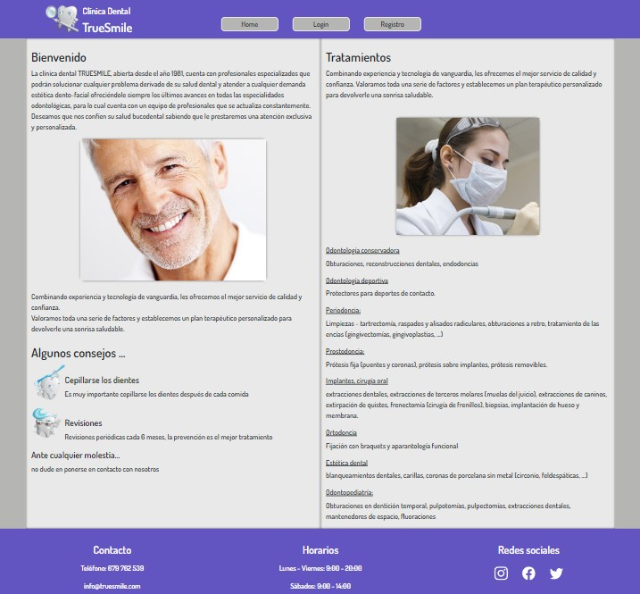
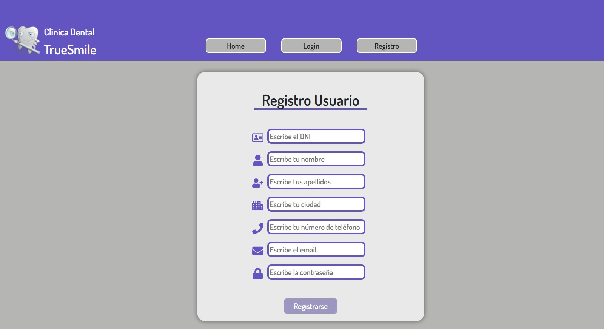
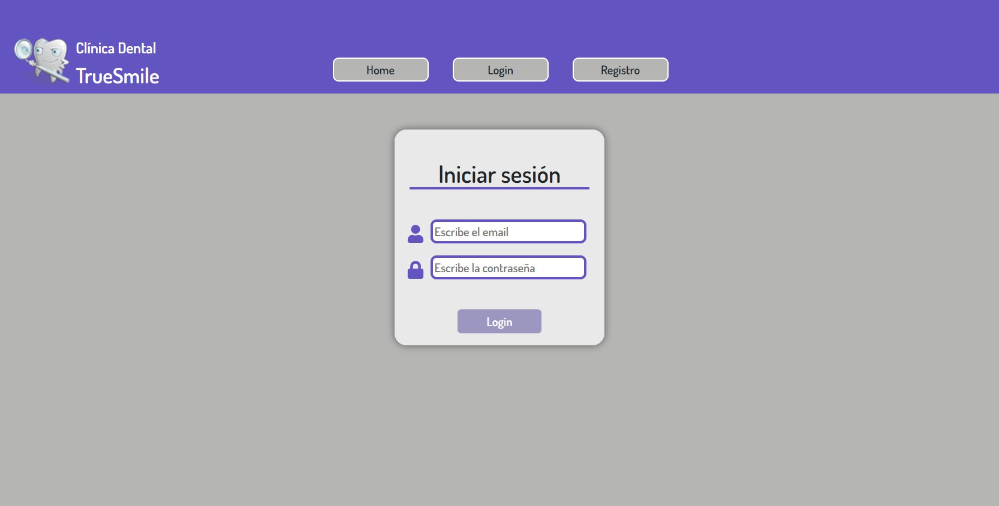
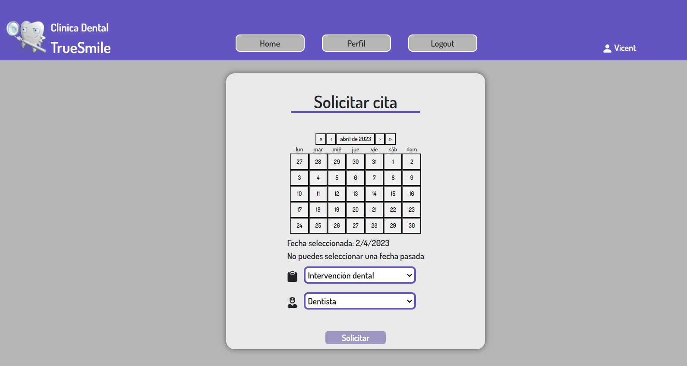

# FrontEnd Clínica Dental TrueSmile

<details>
  <summary>Contenido 📝</summary>
  <ol>
    <li><a href="#objetivo-🎯">Objetivo</a></li>
    <li><a href="#sobre-el-proyecto-🔎">Sobre el proyecto</a></li>
    <li><a href="#deploy-🚀">Deploy</a></li>
    <li><a href="#stack">Stack</a></li>
    <li><a href="#instalación-en-local">Instalación</a></li>
    <li><a href="#vistas">Vistas</a></li>
    <li><a href="#futuras-funcionalidades">Futuras funcionalidades</a></li>
    <li><a href="#licencia">Licencia</a></li>
    <li><a href="#contacto">Contacto</a></li>
  </ol>
</details>

## Objetivo 🎯
El objetivo de este proyecto es generar un Frontend que pueda conectarse a un Backend ya generado anteriormente y poder gestionar su base de datos mediante solicitudes HTTP

## Sobre el proyecto 🔎
El proyecto es un frontEnd de una clínica dental, donde los visitantes a la web pueden registrarse y mediante su usuario podrán crear, visualizar y eliminar citas de las intervenciones dentales ofrecidas por la clínica. La web tiene tres tipos de usuario con distintos permisos:
    - Cliente
    - Dentista
    - Administrador
Mediante el login con sus credenciales, los tres tipos de usuarios podrán revisar sus datos en la vista datos de perfil de usuario.
Clientes y dentistas podrán ver únicamente sus citas, en cambio el administrador podrá revisar las citas tanto de todos los clientes como de todos los dentistas.
Solamente podrán crear citas los usuarios clientes, sin embargo si que podrán elimiar citas los tres tipos de usuario.
El usuario administrador, además también podrá ver la información de todos los perfiles de usuario que existan en la base de datos.
Todos los campos de entrada de datos del login de ususario, registro de usuario y registro de cita tienen su control de errores.
  
## Deploy 🚀
<div align="center">
    <a href="https://rgolfe81.github.io/FrontEnd-ClinicaDental-TrueSmile/"><strong>Url a producción </strong></a>🚀🚀🚀
</div>

## Stack
<div align="center">
<a href="https://www.reactjs.com/">
    
</a>
<a href="https://developer.mozilla.org/es/docs/Web/JavaScript">
    
</a>
 </div>

## Instalación en local
1. Clonar el repositorio
2. ` $ npm install `
3. ``` $ npm run dev ```
4. ...

## Vistas
Landing
  
Register

Login

Profile

Crear citas

Revisar citas


## Futuras funcionalidades
⬜ Crear cita mediante botones seleccionables
⬜ Editar campos del perfil de usuario
⬜ Filtar citas mediante buscador
 
⬜ ...  


## Licencia
Este proyecto se encuentra bajo licencia MIT
 

## Contacto

<a href = "mailto:rgolfe81@gmail.com"></a>
<a href="https://www.linkedin.com/in/ruben-golfe/" target="_blank"></a> 
</p>
